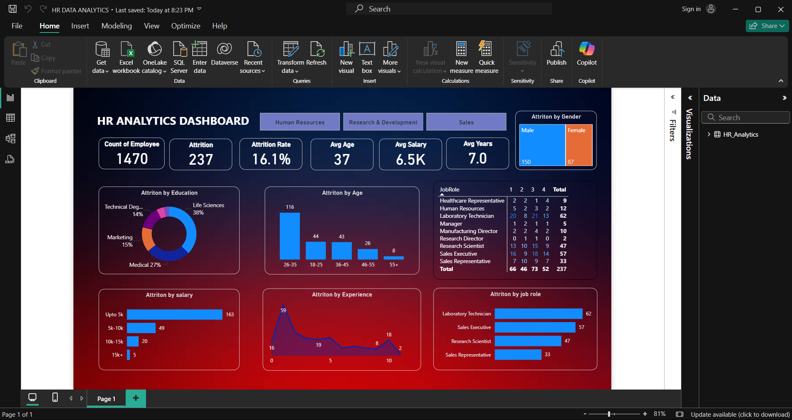
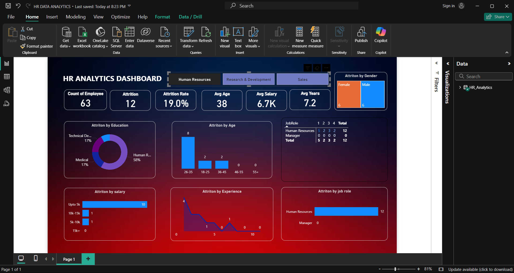
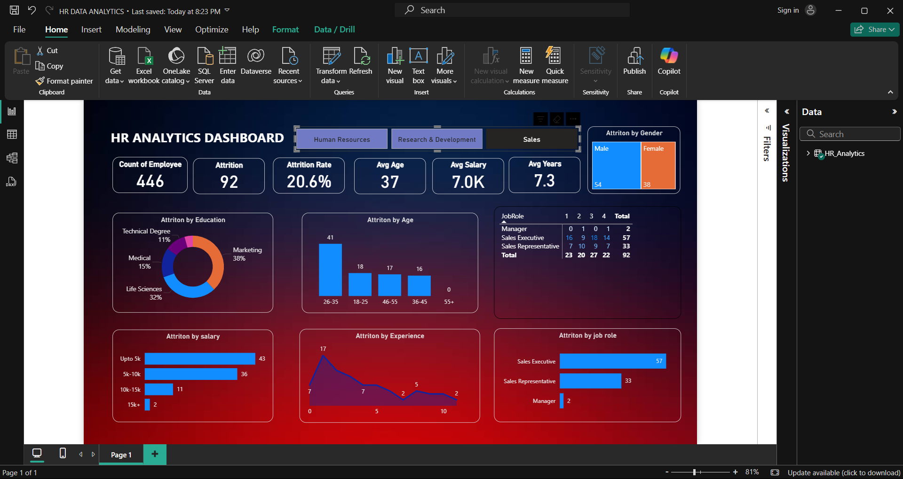
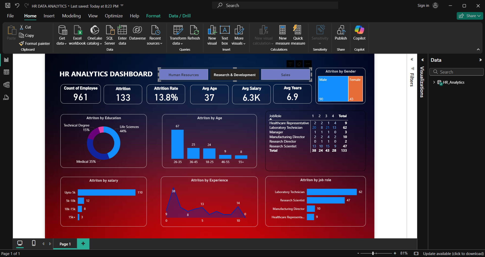

# 📊 HR Analytics Dashboard

The **HR Analytics Dashboard** provides deep insights into **employee attrition**, helping organizations understand workforce trends and make **data-driven decisions** to improve retention.

---

## 📌 Overview  
- Analyze attrition trends across departments, age groups, salary brackets, and job roles.  
- Identify risk factors contributing to higher employee turnover.  
- Provide actionable recommendations for **HR strategy and policy improvements**.  

---

## 📈 Key Findings  
- **237 employees** left the company → **Attrition Rate: 16.1%**  
- Highest attrition among **young professionals (26–35 years)** → **116 employees**  
- Employees with **salary < $5K** had the highest turnover → **163 employees**  
- Job roles with significant attrition: **Laboratory Technicians** & **Sales Executives**  

---

## 🔑 Key Takeaways  
✔ Competitive salaries are crucial for employee retention.  
✔ Career growth opportunities reduce attrition among young professionals.  
✔ High-turnover roles may need better **work-life balance** and **engagement strategies**.  

---

## 🚀 Recommendations to Reduce Attrition  
- Implement **structured mentorship** and career development programs.  
- Conduct **exit interviews** to address employee concerns.  
- Introduce **flexible work policies** to improve satisfaction.  

---

## 🛠️ Tech Stack  
- **Power BI** → Data Visualization  
- **CSV** → Data Sources  
- **DAX** → Calculations & Metrics  
- **Power Query** → Data Transformation  

---

## 📸 Dashboard Previews  

### 🏠 Home Dashboard  

### 👥 HR Overview  

### 📊 Recruitment & Demographics  

### 💼 Sales Attrition  

---

## 📂 Repository Contents  
- `HR DATA ANALYTICS.pbix` → Power BI report file  
- `HR_Analytics.csv` → Dataset  
- `README.md` → Project documentation  
- Dashboard screenshots (`homedash.png`, `hr.png`, `rd.png`, `sales.png`)  

---

## ⭐ About This Project  
This dashboard was created to demonstrate **HR data analytics** capabilities, providing valuable insights into workforce management and attrition patterns.  

If you find this useful, consider giving the repo a ⭐!  

---
